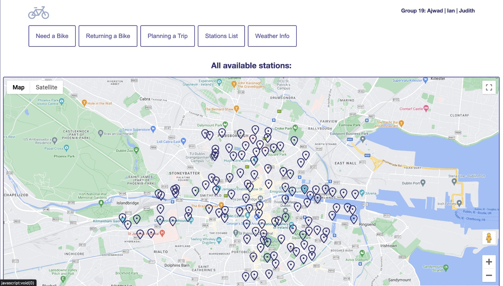

# CycleSense Dublin 
This repository contains code for a Dublin Bikes project that includes multiple components for data processing, visualization, and machine learning predictions related to Dublin Bikes usage.

## Features
- Plan a trip with your start and end destination and get a map of the nearest available bike stand and dropoff stand location
- Shows you your closest bike station for returning and renting a bike
- Charts showing availabity of past 7 days for each bike stand and number of bikes that are, on average, available
- RandomForest model that predicts bike availbities for next 5 days so you can plan your trip with ease
- Flask server that connects our RDS Database linked to our EC2 instance
- API calls being made every 5 minutes to OpenWeather and JCDecaux API to store in the RDS database
- Latest data from database queried every time a user wants to plan a trip

## Contact
If you have any questions or need further information, please contact the project owner or contributors via the GitHub repository.
